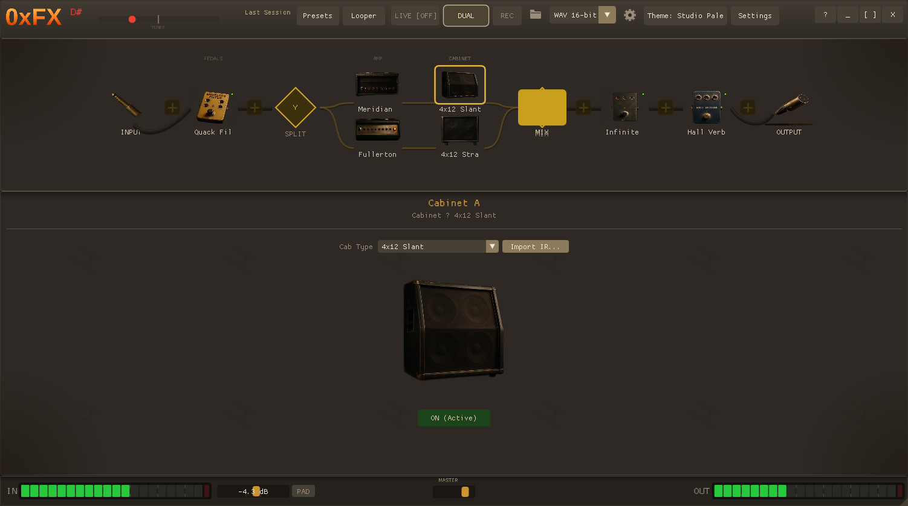
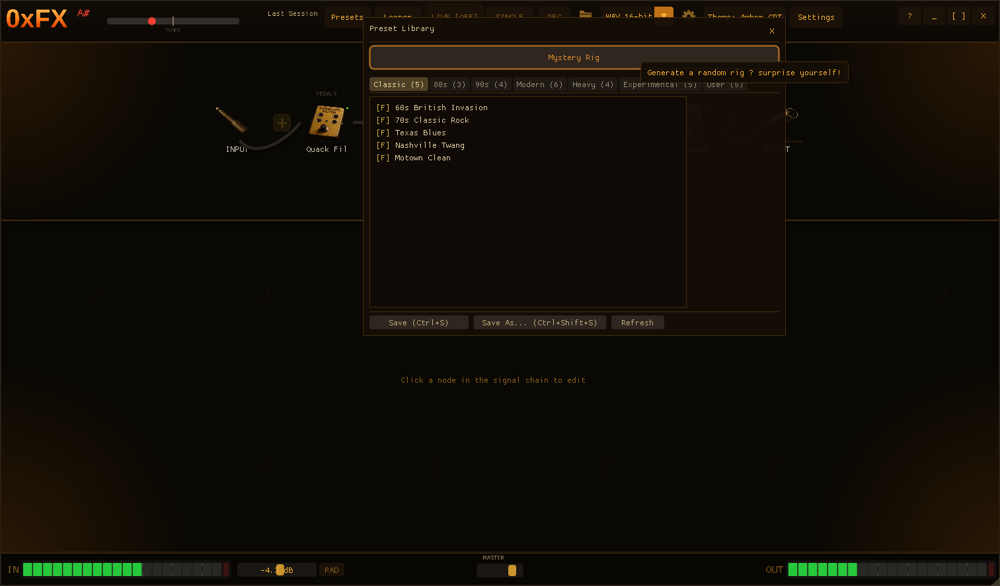
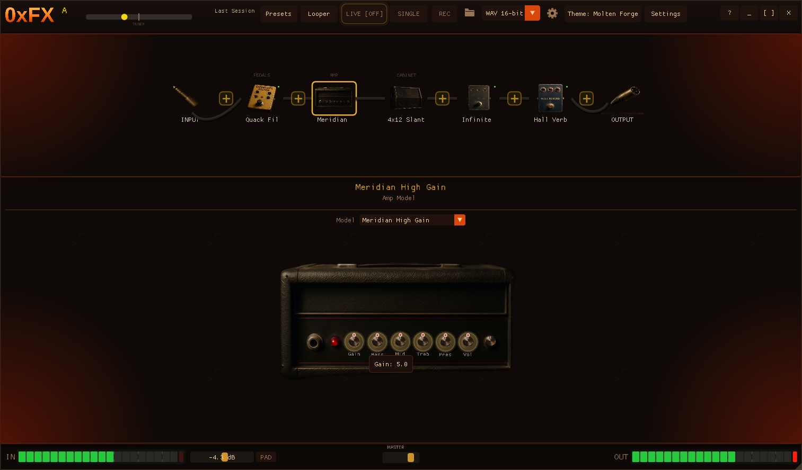
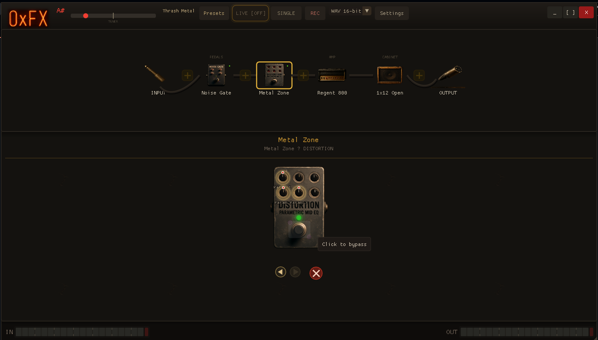
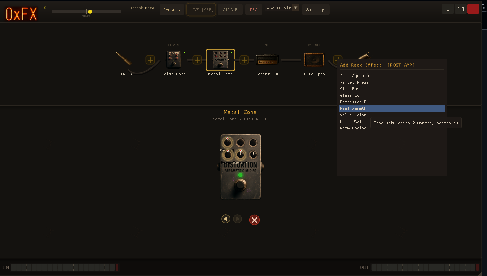
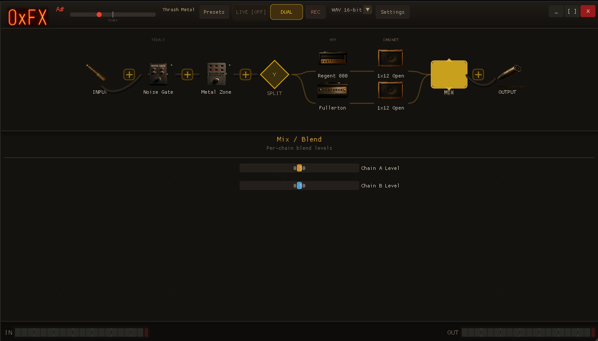

# 0xFX

**Guitar amp simulator & effects pedalboard — open source, cross-platform**

Real-time guitar effects processor and amp simulator. Standalone app + CLAP/VST3 plugins. Pure C99 DSP engine with skeuomorphic GUI. Circuit-accurate tone stacks modeled from real amplifier schematics.

**12 amp models** (circuit-modeled from real schematics) | **41 effect pedals** | **9 rack processors** | **10 mic models** | **137 automatable parameters** | **32 factory presets**

---

<p align="center">
  <a href="docs/screenshots/main-view.png"></a>
  <a href="docs/screenshots/preset-browser.png"></a>
  <a href="docs/screenshots/amp-selector.png"></a>
</p>
<p align="center">
  <a href="docs/screenshots/pedal-closeup.png"></a>
  <a href="docs/screenshots/rack-effects.png"></a>
  <a href="docs/screenshots/dual-chain.png"></a>
</p>

---

## Signal Flow

```
Input → [Gate] → [Pre Pedals] → AMP → CAB → [Mic Sim] → [Rack FX] → Output
                                  ↕ (parallel chains with mix)
```

- Dual amp chains with independent amp/cab/mic per chain
- Pre/post amp pedal placement
- Rack effects after cab (compressors, EQ, tape saturation, limiters)
- Optional microphone simulation with distance/angle/position controls
- Chromatic tuner with MPM pitch detection

---

## Amp Models (12)

All tone stacks modeled from actual circuit schematics using the Yeh/Abel/Smith DAFX transfer function with bilinear transform digitization.

| Model | Inspired By | Tone Stack | Character |
|---|---|---|---|
| Fullerton Clean | Fender Twin Reverb | Fender TMB (AB763) | Clean, chimey American — silver panel era |
| Tweed Blues | Fender Bassman | Fender TMB (5F6-A) | Warm vintage breakup |
| Emerald Ratrod Deluxe | Fender Hot Rod Deluxe | Fender TMB (PR246) | American hotrod — clean to gritty drive, 6L6 punch |
| British Crunch | Marshall Plexi | Marshall TMB (1959) | Classic British crunch |
| Regent 800 | Marshall JCM800 | Marshall TMB (2203) | Single-channel rock aggression |
| Southwest Lead | Mesa Rectifier | Fender TMB (modified) | High-gain American lead |
| Meridian High Gain | Peavey 5150/6505 | Fender TMB (5150 lead) | Scooped, brutal modern metal |
| Essex Chime | Vox AC30 | Vox Cut Control | British chime, Class A jangle |
| Citrus Roar | Orange Rockerverb | Marshall TMB (Rockerverb) | Thick British EL34 warmth |
| Citrus Terror | Orange Tiny Terror | Tilt EQ | Class A lunchbox grit |
| Solar Monolith | Sunn Model T | Fender TMB (Sunn) | Massive doom, crushing fuzz |
| Eclipse Drone | Sunn O))) | Fender TMB (Sunn) | Extreme low-end with feedback sustain |

Each model: cascaded waveshaper preamp (1–4 stages) → circuit-modeled tone stack → power amp compression + sag.

## Effects Pedals (41)

| Category | Pedals |
|---|---|
| **Overdrive** | Jade Drive, Gold Drive, Blues Grit |
| **Distortion** | Rodent, Orange Dist, Metal Zone, Amp Box |
| **Fuzz** | Mammoth Fuzz, Round Fuzz, Wraith Fuzz, Chaos Fuzz |
| **Delay** | Echo Delay, Carbon Delay, Tape Machine, Memory Echo |
| **Reverb** | Drip Verb, Hall Verb, Plate Verb, Shimmer Verb, Cloud Verb |
| **Modulation** | Liquid Chorus, Phase Sweep, Jet Flanger, Pulse Trem, Drift Vibrato |
| **Wah/Filter** | Howl Wah, Quack Filter, Tone Sculptor, Precision EQ |
| **Dynamics** | Squeeze Box, Glass Comp, Punch Comp, Noise Gate |
| **Pitch** | Octave Engine, Pitch Warp |
| **Utility** | Grit Crush, Ring Tone, Warm Tape |
| **Experimental** | Loop Station, Infinite Hold, Grain Cloud |

## Rack Effects (9)

Post-amp/cab rack-mount studio processors:

| Rack Effect | Type | Inspired By |
|---|---|---|
| Iron Squeeze | FET compressor | 1176 |
| Velvet Press | Optical compressor | LA-2A |
| Glue Bus | VCA bus compressor | SSL G-bus |
| Glass EQ | Passive EQ | Pultec EQP-1A |
| Precision EQ | Channel EQ | Neve 1073 |
| Reel Warmth | Tape saturation | Studer/Ampex |
| Valve Color | Tube saturation | Culture Vulture |
| Brick Wall | Brickwall limiter | Modern mastering |
| Room Engine | Room simulation | Early reflections |

## Microphone Simulation (optional, per-chain)

10 models (9 + DI bypass) with distance, angle, and cone position controls:

| Mic | Type | Inspired By |
|---|---|---|
| Stage Workhorse | Dynamic | SM57 |
| Roadie Vocal | Dynamic | SM58 |
| Berlin Dynamic | Dynamic | Sennheiser e609 |
| Silver Bullet | Dynamic | EV RE20 |
| Velvet Ribbon | Ribbon | Royer R-121 |
| Heritage Ribbon | Ribbon | Coles 4038 |
| Studio Large | Condenser | Neumann U87 |
| Austrian Pencil | Condenser | AKG C414 |
| Room Pencil | Condenser | AKG C451 |

Default: DI (direct inject, no mic coloration).

## Cabinet IR

- 5 built-in synthetic IRs: 1x12 open, 2x12 closed, 4x12 straight, 4x12 slant, direct
- Load any `.wav` impulse response
- FFT overlap-add convolution (KissFFT)
- Unity-gain normalization — shapes tone without changing volume

## GUI Features

- **Skeuomorphic design** — photorealistic amp faceplates, pedal body images, rack-mount units
- **Interactive overlay knobs** with position indicator dots, parameter labels
- **Stomp switch** — click the footswitch on pedal images to bypass/activate
- **LED indicators** — green glow active, dim red bypassed
- **Section labels** — PEDALS, AMP, CABINET, RACK FX above signal chain
- **Signal chain visualization** — TRS input plug, XLR output connector, realistic cable rendering
- **Preset browser** — genre-organized factory presets, save/load user presets
- **Recording** — WAV (16/24-bit), MP3 (192/320kbps), FLAC (16/24-bit) with timestamped filenames
- **Chromatic tuner** — MPM algorithm for accurate fundamental detection
- **Input monitoring** — VU meters and tuner work without audio output (LIVE off)
- **MIDI CC control** with MIDI learn mode
- **Scroll-wheel** amp model and cab type cycling

## Additional Features

- **CLAP + VST3 plugins** (137 automatable parameters, factory presets, MIDI CC)
- **Thread-safe multi-instance** — run multiple 0xFX instances in the same DAW session without crashes. Per-instance ImGui contexts, global render mutex, per-thread texture cache.
- **Multi-plugin coexistence** — 0xFX + 0x808 + 0xSYNTH can all run simultaneously in the same DAW. No SDL2 in plugins — native Win32+WGL (Windows), X11+GLX (Linux).
- **Debug audio recorder** — captures input+output to WAV for troubleshooting
- **Dual amp chains** with independent routing and mix
- **Preset system** — `.0xfx` JSON open format, human-readable, session auto-save/restore
- **32 factory presets** organized by genre: Classic, 80s, 90s, Modern, Heavy, Experimental

---

## Installation

Download from [Releases](https://github.com/averagenative/0xFX/releases).

| Platform | Architecture | Installer | Portable |
|----------|-------------|-----------|----------|
| Windows | x64 | `0xFX-*-windows-x64-setup.exe` | `0xFX-*-windows-x64.zip` |
| Windows | ARM64 | `0xFX-*-windows-arm64-setup.exe` | `0xFX-*-windows-arm64.zip` |
| macOS | Universal (Intel + Apple Silicon) | `0xFX-*-macos-universal.dmg` | `0xFX-*-macos-universal.zip` |
| Linux | x64 | — | `0xFX-*-linux-x64.tar.gz` |
| Linux | ARM64 | — | `0xFX-*-linux-arm64.tar.gz` |

### Windows

- **Installer** (`0xFX-*-setup.exe`): Installs standalone + plugins to standard locations, Start Menu + Desktop shortcuts, uninstaller
  - CLAP: `C:\Program Files\Common Files\CLAP\`
  - VST3: `C:\Program Files\Common Files\VST3\0xFX.vst3\Contents\{arch}\`
- **Zip**: Manual install — copy plugins to the paths above, run `0xfx_gui.exe` standalone
- ARM64 builds are native for Surface Pro, Snapdragon laptops, etc. (x64 builds also work via emulation)

### macOS

- **DMG**: Drag 0xFX to Applications. Universal binary runs natively on both Intel and Apple Silicon (M1/M2/M3/M4).
- **Plugins**: Copy `0xFX.clap` to `~/Library/Audio/Plug-Ins/CLAP/` and `0xFX.vst3` bundle to `~/Library/Audio/Plug-Ins/VST3/`

### Linux

- **tar.gz**: Extract, copy plugins to `~/.clap/` and `~/.vst3/`, run `./0xfx_gui`
- **AppImage** (x64 only): `chmod +x 0xFX-*.AppImage && ./0xFX-*.AppImage`
- ARM64 builds target Raspberry Pi 4/5, Pine64, ARM Chromebooks, etc.

---

## Building from Source

All platforms require **CMake 3.16+** and **Python 3** (for asset generation). The build auto-generates `src/gui/embedded_assets.c` from the PNG assets in `resources/`.

**Targets:** `0xfx_gui` (standalone) · `0xfx_clap` (CLAP plugin) · `0xfx_vst3` (VST3) · `fx_api_test` (tests)

### Linux

```bash
# Prerequisites (Debian/Ubuntu)
sudo apt install libsdl2-dev libgl-dev g++ cmake python3

# Build
git clone https://github.com/averagenative/0xFX.git && cd 0xFX
cmake -B build -DCMAKE_BUILD_TYPE=Release
cmake --build build -j$(nproc)

# Run
./build/0xfx_gui

# Install plugins (optional)
mkdir -p ~/.clap ~/.vst3
cp build/0xFX.clap ~/.clap/
cp -r build/0xFX.vst3.bundle ~/.vst3/0xFX.vst3
```

### macOS

```bash
# Prerequisites
brew install sdl2 cmake python3

# Build
git clone https://github.com/averagenative/0xFX.git && cd 0xFX
cmake -B build -DCMAKE_BUILD_TYPE=Release
cmake --build build -j$(sysctl -n hw.ncpu)

# Run
./build/0xfx_gui

# Install plugins (optional)
mkdir -p ~/Library/Audio/Plug-Ins/CLAP ~/Library/Audio/Plug-Ins/VST3
cp build/0xFX.clap ~/Library/Audio/Plug-Ins/CLAP/
cp -r build/0xFX.vst3.bundle ~/Library/Audio/Plug-Ins/VST3/0xFX.vst3
```

### Windows (Cross-Compile from Linux via MinGW)

```bash
# Prerequisites (on Linux)
sudo apt install mingw-w64 cmake python3

# x64 build
cmake -B build_win -DCMAKE_TOOLCHAIN_FILE=cmake/mingw-w64.cmake -DCMAKE_BUILD_TYPE=Release
cmake --build build_win -j$(nproc)

# ARM64 build (requires llvm-mingw — https://github.com/mstorsjo/llvm-mingw/releases)
LLVM_MINGW_PREFIX=/path/to/llvm-mingw \
cmake -B build_win_arm64 -DCMAKE_TOOLCHAIN_FILE=cmake/llvm-mingw-arm64.cmake -DCMAKE_BUILD_TYPE=Release
cmake --build build_win_arm64 -j$(nproc)
```

### Windows (Native with MSVC)

```powershell
# Prerequisites: Visual Studio 2019+, CMake, Python 3, SDL2 (via vcpkg or manual)
cmake -B build -DCMAKE_BUILD_TYPE=Release
cmake --build build --config Release
```

### Linux ARM64 (Cross-Compile from x64)

```bash
# Prerequisites
sudo apt install gcc-aarch64-linux-gnu g++-aarch64-linux-gnu
sudo dpkg --add-architecture arm64
sudo apt install libgl-dev:arm64 libx11-dev:arm64 libasound2-dev:arm64

# Build
cmake -B build_linux_arm64 -DCMAKE_TOOLCHAIN_FILE=cmake/aarch64-linux-gnu.cmake -DCMAKE_BUILD_TYPE=Release
cmake --build build_linux_arm64 -j$(nproc)
```

### Asset Generation

Visual assets (PNGs) are committed to `resources/`. The build auto-generates `src/gui/embedded_assets.c` (~95MB, gitignored) from them via Python3. CMake runs this automatically when PNGs change. To regenerate manually:

```bash
python3 tools/generate_embedded_assets.py            # regenerate embedded_assets.c
python3 tools/generate_embedded_assets.py --dry-run  # list assets without writing
```

If Python3 is not available, the build will use a pre-existing `embedded_assets.c` if one exists.

### Release Packaging

```bash
./scripts/packaging/package_release.sh 1.1.0
# Outputs: linux-x64 tar.gz + AppImage, windows-x64 zip + NSIS installer

# ARM64 installers (after building ARM64 targets above)
makensis scripts/packaging/0xfx_installer.nsi         # Windows x64 installer
makensis scripts/packaging/0xfx_installer_arm64.nsi   # Windows ARM64 installer

# macOS (run on Mac)
./scripts/packaging/package_macos.sh 1.1.0            # Universal .dmg + .zip
```

---

## Architecture

```
Layer 4: Host Wrappers — Standalone (SDL2) | CLAP | VST3
Layer 3: GUI — C++ / Dear ImGui / OpenGL 3.3
Layer 2: Audio I/O — miniaudio (duplex) + MIDI input
Layer 1: DSP Engine — pure C99, zero deps, RT-safe
```

GUI and plugins interact exclusively through the public API (`fx_engine.h`). No internal struct access. Engine is real-time safe: no allocation in the audio callback.

---

## Trademark Disclaimer

All names are original. References to commercial products in documentation are for technical description only. 0xFX is not affiliated with any amp or pedal manufacturer.

## License

MIT
